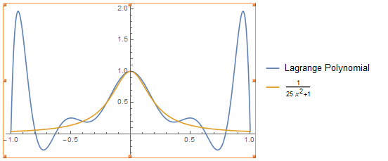
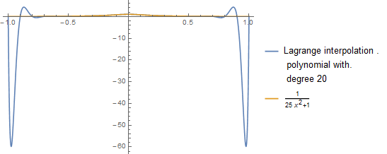

2015/11/1

拟解决的问题:不同方法对同一多项式做插值结果比较

解决思路或方法：使用课本上标准算法

结果展示：对n=10的等距节点的情况用Lagrange插值得10次多项式，

图形如下：

{width="4.666666666666667in"
height="1.964912510936133in"}

如果n=20，则图形为：

{width="4.310672572178477in"
height="1.739394138232721in"}

可以看出在中间插值多项式对原函数近似的较好,但在接近正负1的地方，随着n的增大，出现奇异性,
插值多项式远远偏离原函数.

对结果的分析以及最后的结论
