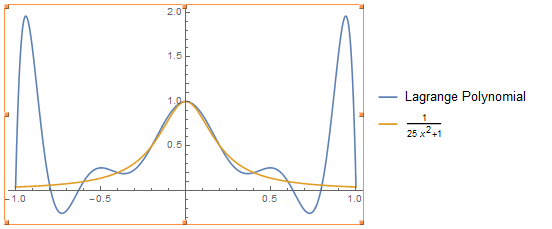
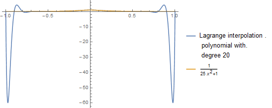
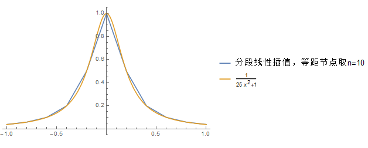
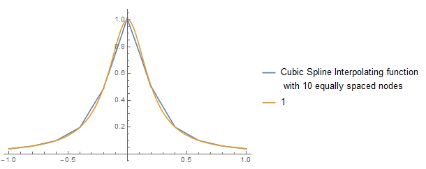

拟解决的问题:不同方法对同一多项式做插值结果比较

解决思路或方法：使用课本上标准算法

结果展示：对n=10的等距节点的情况用Lagrange插值得10次多项式，

图形如下：

{width="4.666666666666667in"
height="1.964912510936133in"}

如果n=20，则图形为：

{width="4.310672572178477in"
height="1.739394138232721in"}

可以看出在中间插值多项式对原函数近似的较好,但在接近正负1的地方，随着n的增大，出现奇异性,
插值多项式远远偏离原函数.

{width="5.760416666666667in"
height="2.3229166666666665in"}

由上图可以看出，用分段线性插值法即可得到对原被插值函数较好的近似。

由分段线性插值误差估计式(课本式（4.2）)，插值的分段线性函数偏离被插值函数的最大距离不超过0.25,实际计算的值为0.05.

若采用三次样条插值函数：

{width="5.760416666666667in"
height="2.2916666666666665in"}

使用误差估计式（5.10）得插值的三次样条函数偏离被插值函数的最大距离不超过0.3125,实际计算的值为0.048.可见在无究范数的度量下两种插值方法误差十分接近，但样条插值虽得到光滑性更好的插值函数（二次连续可微），但计算量较大。
