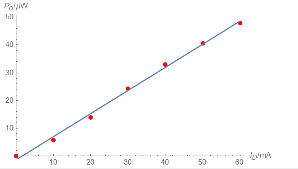
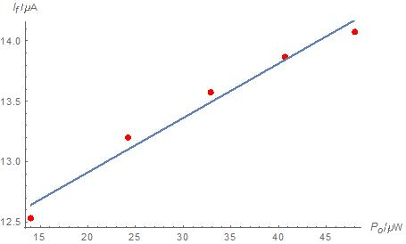
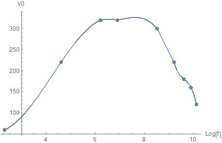
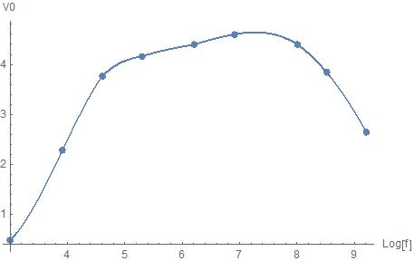

> {width="3.3263199912510935in"
> height="1.8958333333333333in"}
>
> **LED电光特性，线性工作区。**
>
> {width="3.4895833333333335in"
> height="2.10625in"}**SPD光电二极管的Po-If曲线.**
>
> {width="3.4166666666666665in"
> height="2.182638888888889in"}
>
> **发送器调制电路的幅频特性曲线如上，**
>
> {width="3.5104166666666665in"
> height="2.2037620297462817in"}
>
> **接收器调制电路的幅频特性曲线如上。**
