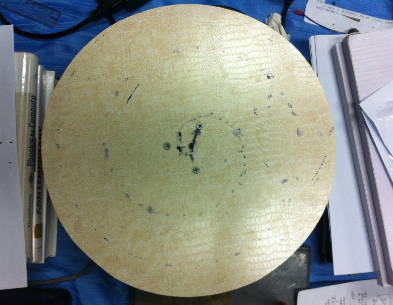
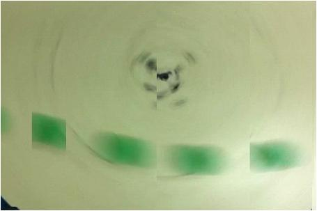
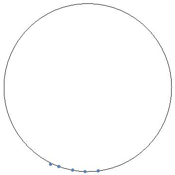

可以考虑的实验：

Problem 9 Water Wave

Problem 13 Paper Vice

Problem 14 Sensitive Flame

Problem 16 Frisbee Vortices

以上实验我认为如果实验现象做出来会比较明显或比较容易实施，

另外我负责的第1题Invent Yourself没有实质性进展。

Problem 11 Rolling on a disk
进展结果为用墨水记录了弹性球在转动的圆盘圆心无初速释放时的轨迹，用人工描点法作了处理，用计算机读入数据作了r=a\*theta线性拟合，拟合效果很差。同时用相机拍了小球直线滚上转盘的照片，由于相机帧数有限，效果图如下：

{width="5.768055555555556in"
height="4.477777777777778in"}

{width="5.768055555555556in"
height="3.8421281714785653in"}

理论结果是圆周运动，那么拟合后

{width="3.75in"
height="3.7395833333333335in"}

Problem 12 Van der Pauw method:

测金属片的电导率实验失败，当时考虑用示波器读低电压但捣鼓了一晚上还是测不了，而且到最后严重怀疑借来的直流稳压源被弄坏了，显示示数与万用表不一致。

不过之前测水的电阻率似乎成功了。相关照片由于手机被拿去修理而暂时得不到。稍后发。

其他"扔掉的"题目还有：

Problem 3 Acoustic Lens;

Problem 17 Crazy Case;

时间节点参考：

大致的实验步骤

1.  利用可买到的廉价设备和对既有之材料进行加工完成实验器材的准备，可边做边学加工方法（必学：木工，以定制物体运动环境）。必做的实验有Problem
    11和Problem 12。事后我考虑Problem
    11可以用餐桌转盘（手动转）、玻璃球（我家均有此二物）试一下,Problem
    12可以测硅片（来源？）电导。

2.  实验场地： 备选 1 我家客厅Ping-Pong ball 的桌子，2
    我家另一套房子的阁楼（attic）

> 后者不能上网。3或其他合适地点。

3.  先做现象（预实验），选择合适的仪器（？？）和方法（？？）粗略定量做实验记录、并进行简单的数据处理等。

4.  如有时间可考虑其他题目和实验参与者感兴趣的课题。

数值模拟方面，稍后我会发我做的Problem 2 Lagging Pendulum 和Problem 4
Super Ball的模拟动画。但这不是实验重点。
