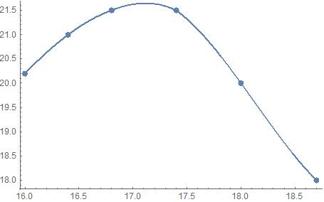
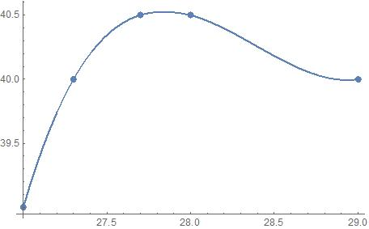
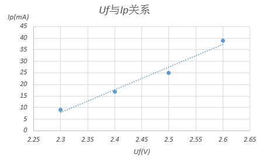
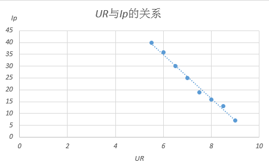

> {width="4.436383420822398in"
> height="2.7604166666666665in"}
>
> **第一个峰附近的数据拟合，横坐标表示扫描电压Ua，纵坐标表示极板电流Ip，下同。**
>
> **可求出Umax1=17.2V**
>
> {width="4.614583333333333in"
> height="2.8542049431321086in"}
>
> **第二个峰附近的数据拟合，可求出Umax2=27.8V**
>
> **Delta U=10.6V.**
>
> **研究Uf对Ip的影响时。固定Ug=2.4V,Ur=9.5V,Ua=35.9V,关系图如下：**
>
> {width="3.8522725284339456in"
> height="2.3541666666666665in"}
>
> **可以看出Ip对Uf的变化比较敏感。Ip与Uf呈正相关，因为电源电压越大，电子初速度越大，板级电流强度越大。**
>
> **研究UR对Ip的影响时，固定Ug=2.4V,Uf=2.2V,Ua=39V,关系图如下：**
>
> {width="3.7703805774278214in"
> height="2.3125in"}
>
> **UR 与 Ip呈反相关,
> 因为拒斥电压越大，到达另一极板的电子越少，从而电流越小。**
>
> **在研究UGIg的关系时，实验中因UG的变化范围选的太小，得出了错误的趋势，这里略去相关的数据。**
