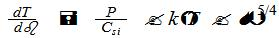

题目：拟合实验曲线法求煤油的比热容

作者：

关键词：

摘要：在煤油的比热容测量讲义中，基于控温法确定kC~si~的方法来求每组实验（不同煤油质量）对应的量热系统的总热容kC~si~实验原理复杂（如对微分方程的处理，Taylor
公式展到4阶），实验中kC~si~近似不变也无理论依据，控温法耗时较长等原因，使笔者探索处理实验数据（每组数据均为每隔30s测得的温差电势，但后者可换算成量热系统内外温差，相当于有离散的ΔT在14个时间点的值）的方法，即使用多项式曲线对坐标平面上的数据点进行拟合，基于{width="3.0104166666666665in"
height="0.46875in"}获取T-τ曲线上各点的导数值，进而用线性回归的方法求出每组数据的
C~si。~计算结果表明，用拟合实验曲线法得到的C~si~和用控温法测得的C~si~（单位：J/K）相对误差不超过0.6%。

拟合实验曲线法原理及操作步骤：

1取用
