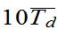
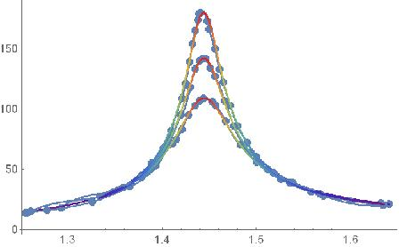
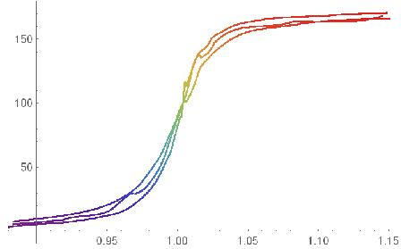
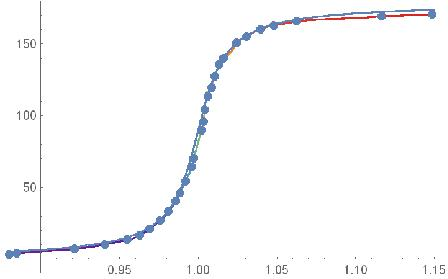

**阻尼振动和受迫振动原始数据处理：**

**任务一的50组振幅：**

**141, 140, 139, 137, 136, 135, 134, 133, 131, 130, 129, 128, 127,
125,**

**124, 123, 122, 121, 120, 119, 117, 117, 115, 114, 113, 112, 111,
110,**

**109, 108, 107, 105, 105, 103, 103, 102, 101, 99, 99, 97, 97, 95, 94,**

**93, 93, 91, 91, 89, 89, 88, 87**

**5组**{width="0.6979166666666666in"
height="0.4375in"}**：14.436, 14.44, 14.443, 14.445, 14.447**

**任务二：测量其他3种阻尼档位的振幅（每组12个数据点），周期基本不变T=1.444。**

  **2档**   **133**   **122**   **113**   **104**   **96**    **88**   **81**   **75**   **69**   **63**   **58**   **53**
  --------- --------- --------- --------- --------- --------- -------- -------- -------- -------- -------- -------- --------
  **3档**   **172**   **149**   **135**   **122**   **110**   **99**   **90**   **81**   **73**   **66**   **60**   **54**
  **4档**   **153**   **134**   **117**   **103**   **90**    **79**   **69**   **60**   **52**   **46**   **40**   **35**

**根据如上数据仿照任务一的方法可计算出阻尼比ζ等其他常用参量，列表如下：**

            **ζ**          **Δζ**       **τ**         **Δτ**       **Q**       **ΔQ**
  --------- -------------- ------------ ------------- ------------ ----------- ----------
  **2档**   **0．01320**   **2.0E-4**   **17．40**    **0．26**    **37.85**   **0.57**
  **3档**   **0.01634**    **4.2E-4**   **14．06**    **0．36**    **30.58**   **0.78**
  **4档**   **0.02140**    **1.7E-4**   **10．739**   **0．086**   **23.36**   **0.19**

**比较上表数据可知，由2至4档阻尼比增大，时间常数τ减小，品质因素减小。**

**任务三：测量受迫振动的幅频特性和相频特性曲线（相关数据见原始数据记录纸）：下图为由高到低分别为2至4档对应的幅频曲线，该图中对每组原始数据点作Hermite样条曲线拟合并与理论上的倒钟型曲线进行了比较，二者符合得较好。图中以周期为横轴，这与讲义上以频率为横轴不同。由图中可以看出，由于阻尼比相较固有频率是小量，共振峰均在T=1.444固有周期附近达到。**

{width="4.6875in"
height="2.9166666666666665in"}

**下图为由高到低（较高频部分）分别为2至4档对应的相频曲线，中档的测量可能有较大误差，拟合出的曲线不光滑**

{width="4.6875in"
height="2.9270833333333335in"}

**由于三种情形阻尼比相差不大，故距离较近，不易将理论曲线画在同一张图上，但经计算机作图检验可知三种情形均与理论值符合的较好**

**比如对于2档：**

{width="4.6875in"
height="2.9270833333333335in"}

**由于技术原因和时间匆促，以上作图均未标明横纵坐标等信息。**
