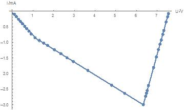
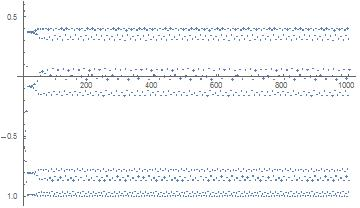

非线性负阻的伏安特性曲线

{width="3.75in"
height="2.2395833333333335in"}

思考题：x=0.54321, 迭代100次后为0.050847;

x=0.54322,迭代100次后为0.24292.

k在0到0.75之间时对上述初值结果基本相同，且迭代几次就很快收敛到一稳定值;

k在0.75到1.23之间时结果不收敛，在-1和0之间来回变化（二倍周期分叉）;但对初值的变化不敏感。

k=1.310时出现4倍周期分叉，即结果在4个数中周期性来回变化;
但对初值的变化不敏感。

k=1.4011,8倍周期分叉，如下图所示：{width="3.75in"
height="2.1875in"}
